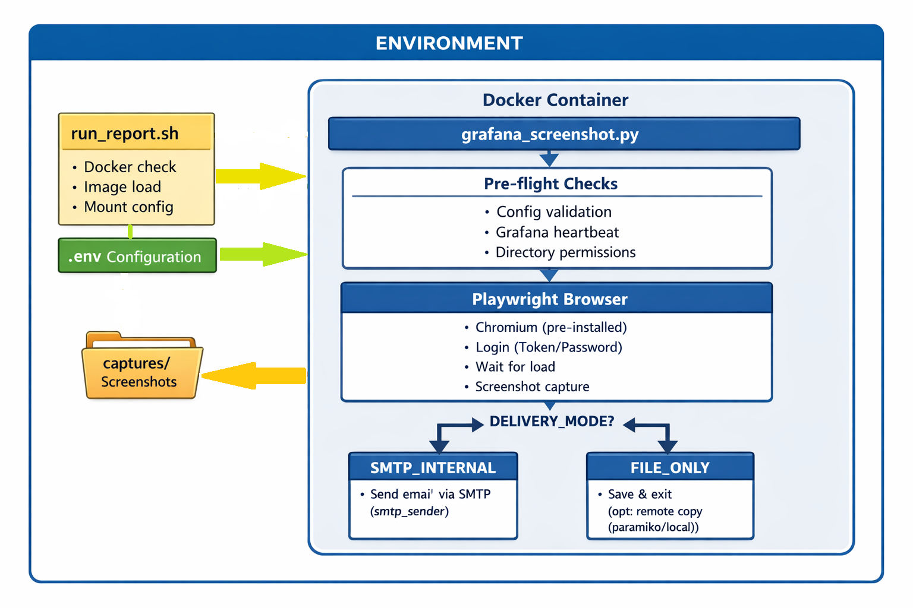

# 📊 GrafMail - Grafana Dashboard Screenshot & Delivery Tool


> Automated Grafana dashboard screenshot tool for DevOps monitoring. Captures PNG/PDF reports and sends via email SMTP or SFTP. Supports Docker and air-gapped deployment..

---

## 📑 Table of Contents
- [Features](#features)
- [Architecture Overview](#architecture-overview)
- [Project Structure](#project-structure)
- [Quick Start](#quick-start)
  - [Configure](#1-configure)
  - [Build](#2-build)
  - [Run](#3-run)
  - [Cronjob](#4-cronjob)
  - [Log Rotation](#5-log-rotation)
- [Delivery Modes](#delivery-modes)
  - [SMTP_INTERNAL](#smtp_internal)
  - [FILE_ONLY](#file_only)
- [PDF Mode](#pdf-mode)
- [Capture Organization](#capture-organization)
- [No-Images Behavior](#no-images-behavior)
- [Docker Networking](#docker-networking)
- [Docker Resource Limits](#docker-resource-limits)
- [Configuration Reference](#configuration-reference)
  - [Grafana URL Breakdown](#grafana-url-breakdown)
  - [Grafana Connection](#grafana-connection)
  - [Panel & Capture](#panel--capture)
  - [Screenshot Settings](#screenshot-settings)
  - [Dashboard Rendering](#dashboard-rendering)
  - [Delivery Mode](#delivery-mode)
  - [SMTP Configuration (SMTP_INTERNAL)](#smtp-configuration-smtp_internal)
  - [Remote Copy (FILE_ONLY)](#remote-copy-file_only)
  - [Retry & Timeout](#retry--timeout)
  - [Docker Resource Limits](#docker-resource-limits-1)
  - [File Cleanup](#file-cleanup)
  - [Advanced](#advanced)
- [Security Best Practices](#security-best-practices)
- [Paramiko SSH Setup (Remote File Transfer)](#paramiko-ssh-setup-remote-file-transfer)
  - [How Authentication Works](#how-authentication-works)
  - [Quickest Setup (Auto-Mount via run_report.sh)](#quickest-setup-auto-mount-via-run_reportsh)
  - [If You Don't Have an SSH Key](#if-you-dont-have-an-ssh-key)
  - [Password Authentication](#password-authentication)
  - [Manual Docker Mount (Without run_report.sh)](#manual-docker-mount-without-run_reportsh)
  - [Host Key Verification](#host-key-verification)
- [Air-Gapped Deployment](#air-gapped-deployment)
- [Troubleshooting](#troubleshooting)

---

## Features

- **Dual delivery modes** — `SMTP_INTERNAL` (email from Docker) or `FILE_ONLY` (save-only, external email)
- **HTML email** with inline-embedded screenshots (Content-ID), plain-text fallback
- **PDF support** — capture as PDF and auto-merge into a single report file
- **PDF email attachments** with 10 MB size limit enforcement
- **CC / BCC** support, custom subjects and bodies
- **Dashboard UID subfolders** — organized captures in `captures/{uid}/`
- **Flexible remote copy** — choose `paramiko` (Python SFTP) or `local` file copy
- **Retry on capture failure** with configurable retry count
- **Per-dashboard timeout** control
- **Docker resource limits** (memory, CPU) configurable via `.env`
- **Multi-environment support** — run different dashboards with different `.env` files via cronjob
- **Air-gapped deployment** — Docker image save/load, offline Chromium
- **Automatic file cleanup** — recursive, with empty directory removal

---

## Architecture Overview

```text
┌─────────────────────────────────────────────────────────────────────────────┐
│                               ENVIRONMENT                                   │
├─────────────────────────────────────────────────────────────────────────────┤
│                                                                             │
│  ┌─────────────────┐     ┌─────────────────────────────────────────────┐    │
│  │  run_report.sh  │     │              Docker Container               │    │
│  │                 │────▶│  ┌───────────────────────────────────────┐  │    │
│  │  - Docker check │     │  │         grafana_screenshot.py         │  │    │
│  │  - Image load   │     │  │                                       │  │    │
│  │  - Mount config │     │  │  ┌─────────────────────────────────┐  │  │    │
│  └─────────────────┘     │  │  │      Pre-flight Checks          │  │  │    │
│                          │  │  │  - Config validation            │  │  │    │
│  ┌─────────────────┐     │  │  │  - Grafana heartbeat            │  │  │    │
│  │     .env        │────▶│  │  │  - Directory permissions        │  │  │    │
│  │  Configuration  │     │  │  └─────────────────────────────────┘  │  │    │
│  └─────────────────┘     │  │                  │                    │  │    │
│                          │  │                  ▼                    │  │    │
│                          │  │  ┌─────────────────────────────────┐  │  │    │
│  ┌─────────────────┐     │  │  │      Playwright Browser         │  │  │    │
│  │    captures/    │◀────│  │  │  - Chromium (pre-installed)     │  │  │    │
│  │  Screenshots    │     │  │  │  - Login (Token/Password)       │  │  │    │
│  └─────────────────┘     │  │  │  - Wait for load                │  │  │    │
│                          │  │  │  - Screenshot capture           │  │  │    │
│                          │  │  └─────────────────────────────────┘  │  │    │
│                          │  │                  │                    │  │    │
│                          │  │   ┌──────────────┴──────────────┐     │  │    │
│                          │  │   │       DELIVERY_MODE?        │     │  │    │
│                          │  │   └──────┬─────────────┬────────┘     │  │    │
│                          │  │          ▼             ▼              │  │    │
│                          │  │  ┌─────────────┐ ┌────────────────┐   │  │    │
│                          │  │  │SMTP_INTERNAL│ │   FILE_ONLY    │   │  │    │
│                          │  │  │ Send email  │ │ Save & exit    │   │  │    │
│                          │  │  │ via SMTP    │ │ (opt: remote   │   │  │    │
│                          │  │  │(smtp_sender)│ │  copy (paramiko│   │  │    │
│                          │  │  │             │ │  /local))      │   │  │    │
│                          │  │  └─────────────┘ └────────────────┘   │  │    │
│                          │  └───────────────────────────────────────┘  │    │
│                          └─────────────────────────────────────────────┘    │
│                                                                             │
└─────────────────────────────────────────────────────────────────────────────┘
```

---

## Project Structure

When you `git clone` this project, initially your build setup should look like this:

```
grafmail/
├── grafana_screenshot.py    # Main application (capture engine + orchestration)
├── smtp_sender.py           # SMTP module (HTML email with inline images / PDF attachments)
├── requirements.txt         # Python dependencies
├── Dockerfile               # Optimized image (python:3.11-slim + Chromium only)
├── .env                     # Configuration template
├── run_report.sh            # Linux runner script
└── captures/                # Screenshot output (UID subdirectories, will be created autometically)
    └── {dashboard_uid}/
```

If you already have the Docker image as a `.tar` file (either built locally or received from elsewhere), see [Air-Gapped Deployment](#air-gapped-deployment) for instructions on loading and running the project after configuring `.env`.

---

## Quick Start

### 1. Configure

> Copy `.env.example` and fill in your values:

```bash
cp .env.example .env_dashboard1
# Edit .env_dashboard1 with your Grafana URL, credentials, delivery mode, etc.
```

### 2. Build

```bash
docker build -t grafmail:latest .
```

> OR to avoid mixing up cache:

```bash
docker build --no-cache -t grafmail:latest .
```

### 3. Run

```bash
./run_report.sh                                    # Default .env
./run_report.sh --env-file /path/.env_dashboard1   # Custom .env
./run_report.sh -e .env_dashboard2 --debug         # Debug mode
```

---

### 4. Cronjob

```crontab
# Dashboard 1 — every 30 minutes
PATH=/usr/local/sbin:/usr/local/bin:/usr/sbin:/usr/bin:/sbin:/bin
5 * * * * /bin/bash /path/to/run_report.sh --env-file /path/to/.env >> /path/to/cron.log 2>&1
```

> Test your crontab entry without waiting by simulating the cron environment manually:

```bash
env -i HOME=/home/user USER=user LOGNAME=user \
    PATH=/usr/local/sbin:/usr/local/bin:/usr/sbin:/usr/bin:/sbin:/bin \
    /bin/bash /path/to/run_report.sh \
    --env-file /path/to/.env
```

---

#### Multi-Dashboard Cronjob

```crontab
# Dashboard 1 — every 30 minutes
*/30 * * * * /path/to/run_report.sh --env-file /path/to/.env_dashboard1

# Dashboard 2 — every 2 hours
0 */2 * * *  /path/to/run_report.sh --env-file /path/to/.env_dashboard2

# Weekly summary — Monday 8 AM
0 8 * * 1    /path/to/run_report.sh --env-file /path/to/.env_weekly
```

---

### 5. Log rotation 

If the cron job runs every 5 minutes, cron.log will grow large fast. Add a simple logrotate config:

```bash
sudo tee /etc/logrotate.d/grafmail << 'EOF'
/path/to/grafmail/cron.log {
    daily
    rotate 7
    compress
    missingok
    notifempty
}
EOF
```

---

## Delivery Modes

### `SMTP_INTERNAL`

Screenshots captured + HTML email sent from inside the Docker container.

- **PNG mode**: Images embedded inline (Content-ID, not raw attachments)
- **PDF mode**: PDF file sent as email attachment
- Professional HTML layout with filename labels per image
- Plain-text fallback for non-HTML clients
- CC / BCC recipients supported
- **10 MB total attachment size limit** — emails exceeding this limit are blocked with an error

### `FILE_ONLY`

Screenshots saved to `CAPTURE_DIR/{dashboard_uid}/`. No email from Docker.

Optional remote copy after capture:

| `REMOTE_COPY_METHOD` | Description | Requirements |
|---|---|---|
| `paramiko` *(default)* | Python SFTP library | `paramiko` pip package (included in requirements.txt) |
| `local` | Local filesystem copy | Destination path must be mounted into container |

---

### PDF Mode

When `SCREENSHOT_FORMAT=pdf`, each panel/viewport is captured as an individual PNG by Playwright. After capture, they are **automatically merged into a single PDF** file (one panel per page).

- Merged file: `grafana_{uid}_report_{timestamp}.pdf`
- Individual PNGs are deleted after successful merge
- Requires `PILLOW` (included in requirements.txt)

---

## Capture Organization

Screenshots are saved in subdirectories named by dashboard UID:

```
captures/
├── edzu0yqxghmgwf/
│   ├── grafana_edzu0yqxghmgwf_viewport_20260220_014800.png
│   ├── grafana_edzu0yqxghmgwf_panel_viewPanel_10_20260220_014812.png
│   └── grafana_edzu0yqxghmgwf_panel_viewPanel_14_20260220_014818.png
└── abc123xyz/
    └── grafana_abc123xyz_report_20260220_020000.pdf   ← merged PDF
```

File cleanup (`FILE_RETENTION_DAYS`) recurses into all subdirectories and removes empty folders.

---

## No-Images Behavior

When no screenshots are captured, behavior is controlled by `NO_IMAGES_ACTION`:

| Value | Behavior |
|---|---|
| `notify` | Send an HTML notification email ("no images captured") — only in `SMTP_INTERNAL` mode |
| `skip` | Exit gracefully with code 0, no email |
| `fail` | Exit with code 2 (default error behavior) |

---

## Docker Networking

`run_report.sh` uses `--network=host` by default. Grafana at `http://localhost:3000` works as-is.

### Docker Resource Limits

Configured via `.env`:

```env
DOCKER_MEMORY=1g     # Container memory limit
DOCKER_CPUS=1.5      # Container CPU limit
```

---

## Configuration Reference

### Grafana URL Breakdown

A typical Grafana dashboard URL looks like this:

```bash
https://<grafana-host>/d/<uid>/<slug>?<params>
```

Example:

```bash

https://grafana.example.com/d/abcd1234/system-metrics?orgId=1&from=now-6h&to=now

```

Breakdown of the parts:

* `/d/`  
  Indicates that the resource is a *dashboard*.

* `<uid>`  
  A unique identifier for the dashboard generated by Grafana.  
  This remains stable even if the dashboard title changes.

* `<slug>`  
  A human-readable version of the dashboard title.  
  It improves readability but is **not used for identification**, so changing it will not break the link as long as the UID remains the same.

* `?params` (query parameters)  
  Optional parameters that control how the dashboard is opened.

Common parameters:

* `orgId` — Organization ID in Grafana.
* `from` / `to` — Time range for the dashboard (e.g., `now-6h`, `now`).
* `var-<name>` — Sets dashboard variables.
* `refresh` — Auto-refresh interval (e.g., `5s`, `1m`).

Example with variables:

```bash

https://grafana.example.com/d/abcd1234/system-metrics?orgId=1&var-host=server01&from=now-1h&to=now

```

This opens the dashboard with a predefined host variable and a specific time range.

### Grafana Connection

| Variable | Default | Description |
|---|---|---|
| `GRAFANA_URL` | *(required)* | Grafana base URL |
| `GRAFANA_DASHBOARD_UID` | *(required)* | Dashboard UID from URL |
| `GRAFANA_DASHBOARD_SLUG` | *(optional)* | Human-readable URL slug |
| `GRAFANA_AUTH_METHOD` | `password` | `password` or `token` |
| `GRAFANA_USERNAME` | | Username for password auth |
| `GRAFANA_PASSWORD` | | Password for password auth |
| `GRAFANA_SERVICE_TOKEN` | | Service Account Token for token auth |
| `GRAFANA_IGNORE_TLS_ERRORS` | `true` | Ignore TLS cert errors (set `false` for production) |

### Panel & Capture

| Variable | Default | Description |
|---|---|---|
| `GRAFANA_PANEL_IDS` | | Comma-separated panel IDs (e.g. `10,14` or `viewPanel:10,panelId:14`) |
| `GRAFANA_PANEL_ID` | | Legacy single panel ID |
| `PANEL_PARAM_TYPE` | `viewPanel` | `viewPanel` or `panelId` |
| `GRAFANA_CUSTOM_PARAMS` | | Additional URL params (e.g. `var-collection=events`) |
| `CAPTURE_VIEWPORT` | `true` | Capture full dashboard viewport |
| `CAPTURE_PANELS` | `true` | Capture individual panels |
| `PANEL_LOAD_WAIT` | `3` | Seconds between panel captures |
| `HIDE_SIDEBAR` | `true` | Hide Grafana sidebar via CSS injection |

### Screenshot Settings

| Variable | Default | Description |
|---|---|---|
| `SCREENSHOT_WIDTH` | `1920` | Viewport width (px) |
| `SCREENSHOT_HEIGHT` | `1080` | Viewport height (px) |
| `SCREENSHOT_FORMAT` | `png` | `png` or `pdf` (PDF auto-merges multiple panels into one file) |
| `SCREENSHOT_FULL_PAGE` | `false` | Capture full page or viewport only |
| `CAPTURE_DIR` | `/app/captures` | Base capture directory (subfolders created per UID) |

### Dashboard Rendering

| Variable | Default | Description |
|---|---|---|
| `DASHBOARD_TIME_FROM` | `now-24h` | Time range start |
| `DASHBOARD_TIME_TO` | `now` | Time range end |
| `DASHBOARD_THEME` | `dark` | `dark` or `light` |
| `DASHBOARD_KIOSK` | `true` | Kiosk mode (hide UI) |
| `DASHBOARD_REFRESH` | | Auto-refresh interval |

### Delivery Mode

| Variable | Default | Description |
|---|---|---|
| `DELIVERY_MODE` | `SMTP_INTERNAL` | `SMTP_INTERNAL` or `FILE_ONLY` |

### SMTP Configuration (SMTP_INTERNAL)

| Variable | Default | Description |
|---|---|---|
| `SMTP_HOST` | *(required)* | SMTP server hostname/IP |
| `SMTP_PORT` | `587` | SMTP port |
| `SMTP_USER` | *(optional)* | SMTP username (omit for no-auth relay) |
| `SMTP_PASSWORD` | *(optional)* | SMTP password (omit for no-auth relay) |
| `SMTP_FROM` | *(required)* | Sender email address |
| `SMTP_TO` | *(required)* | Comma-separated TO recipients |
| `SMTP_CC` | | Comma-separated CC recipients |
| `SMTP_BCC` | | Comma-separated BCC recipients |
| `SMTP_USE_TLS` | `true` | Use STARTTLS (port 587) |
| `SMTP_USE_SSL` | `false` | Use SSL (port 465, overrides TLS) |
| `SMTP_SUBJECT` | `Grafana Dashboard Report` | Email subject prefix |
| `EMAIL_BODY_MESSAGE` | | Custom email body (overrides default) |
| `NO_IMAGES_ACTION` | `notify` | `notify`, `skip`, or `fail` |

> [!NOTE]
> Email attachments are limited to **10 MB total size**. If the combined size of all files exceeds this limit, the email will not be sent. Reduce the number of panels or screenshot resolution to stay under the limit.

### Remote Copy (FILE_ONLY)

| Variable | Default | Description |
|---|---|---|
| `SEND_IMG_TO_REMOTE` | `false` | Enable remote file copy |
| `REMOTE_COPY_PATH` | | Destination: `user@host:/path` or `/local/path` |
| `REMOTE_COPY_METHOD` | `paramiko` | `paramiko` or `local` |
| `SSH_HOST_KEY_POLICY` | `warn` | SSH host key policy: `warn`, `reject`, or `auto` |
| `SSH_KEY_PATH` | *(auto)* | Path to SSH private key inside container (auto-mounted by `run_report.sh`) |
| `SSH_PASSWORD` | | SSH password for password-based auth (alternative to key) |
| `SSH_PORT` | `22` | SSH port for paramiko connections |

### Retry & Timeout

| Variable | Default | Description |
|---|---|---|
| `CAPTURE_RETRY_COUNT` | `2` | Retry attempts for failed captures |
| `CAPTURE_TIMEOUT` | `120` | Per-capture timeout in seconds (max 600) |
| `WAIT_AFTER_LOAD` | `5` | Wait after spinners disappear in seconds (max 300) |

### Docker Resource Limits

| Variable | Default | Description |
|---|---|---|
| `DOCKER_MEMORY` | `1g` | Container memory limit (e.g. `512m`, `1g`, `2g`) |
| `DOCKER_CPUS` | `1.5` | Container CPU limit (e.g. `0.5`, `1`, `1.5`) |

### File Cleanup

| Variable | Default | Description |
|---|---|---|
| `FILE_RETENTION_DAYS` | `7` | Delete files older than X days (0 = disabled) |
| `CLEANUP_ON_START` | `true` | Run cleanup before capture |

### Advanced

| Variable | Default | Description |
|---|---|---|
| `SPINNER_SELECTORS` | | Custom spinner CSS selectors |
| `WAIT_AFTER_LOAD` | `5` | Wait after spinners disappear (seconds) |
| `DEBUG_MODE` | `false` | Verbose logging |

---

## Security Best Practices

- **Never commit `.env` to Git** — add to `.gitignore`
- Use minimal Grafana role (`Viewer`) for service accounts
- Rotate tokens and credentials regularly
- Use HTTPS for Grafana, TLS/SSL for SMTP
- Set `GRAFANA_IGNORE_TLS_ERRORS=false` when using valid TLS certificates
- Set `SSH_HOST_KEY_POLICY=reject` for production SSH/SFTP transfers
- Container runs as non-root user (`appuser`) by default
- Container runs with `--security-opt no-new-privileges`

---

## Paramiko SSH Setup (Remote File Transfer)

When using `REMOTE_COPY_METHOD=paramiko`, the tool connects to the remote server via SSH/SFTP. Authentication must be configured for this to work inside Docker.

### How Authentication Works

The tool tries these methods in order:

| Priority | Method | Configured by | Notes |
|---|---|---|---|
| 1 | **SSH key file** | `SSH_KEY_PATH` | Recommended. Auto-mounted by `run_report.sh` |
| 2 | **Password** | `SSH_PASSWORD` | Set in `.env`. Simple but less secure |
| 3 | **Default keys** | `~/.ssh/id_*` | Fallback. Unlikely inside Docker without mounts |

### Quickest Setup (Auto-Mount via run_report.sh)

If you have an SSH key on the host machine (`~/.ssh/id_rsa`, `id_ed25519`, or `id_ecdsa`), `run_report.sh` **automatically mounts it** into the container when `REMOTE_COPY_METHOD=paramiko`. No extra config needed:

```bash
# 1. Ensure your host user can SSH to the remote server:
ssh user@host    # test it manually first

# 2. Set .env:
REMOTE_COPY_METHOD=paramiko
REMOTE_COPY_PATH=user@host:/path/to/destination

# 3. Run — the key is auto-mounted:
./run_report.sh --env-file .env
```

### If You Don't Have an SSH Key

Generate one on the host machine and copy it to the remote server:

```bash
# Generate a key (on the Docker host):
ssh-keygen -t ed25519 -f ~/.ssh/id_ed25519 -N ""

# Copy it to the remote server:
ssh-copy-id -i ~/.ssh/id_ed25519.pub user@host

# Test the connection:
ssh user@host
```

### Password Authentication

If SSH key auth isn't an option, use password auth:

```env
REMOTE_COPY_METHOD=paramiko
REMOTE_COPY_PATH=user@host:/remote/path
SSH_PASSWORD=your_ssh_password
```

### Manual Docker Mount (Without run_report.sh)

If running Docker directly instead of via `run_report.sh`:

```bash
docker run --rm \
  -v /path/to/.env:/app/.env:ro \
  -v /path/to/captures:/app/captures \
  -v ~/.ssh/id_ed25519:/tmp/ssh_key:ro \
  -v ~/.ssh/known_hosts:/tmp/.ssh/known_hosts:ro \
  -e SSH_KEY_PATH=/tmp/ssh_key \
  -e HOME=/tmp \
  grafmail:latest
```

### Host Key Verification

| `SSH_HOST_KEY_POLICY` | Behavior |
|---|---|
| `warn` *(default)* | Accept unknown keys with a log message. Good for development |
| `reject` | Reject unknown keys. Requires pre-populated `known_hosts` |
| `auto` | Accept all keys silently. Not recommended for production |

`run_report.sh` automatically mounts `~/.ssh/known_hosts` into the container when using paramiko. For `reject` mode, the host must be present in this file.

To pre-populate `known_hosts` for `reject` mode:

```bash
ssh-keyscan -H host >> ~/.ssh/known_hosts
```

> [!NOTE]
> The paramiko host key warnings (`Unknown ssh-ed25519 host key for …`) are **automatically suppressed** when `SSH_HOST_KEY_POLICY=warn` or `auto`. The tool logs its own clear messages instead.

---

## Air-Gapped Deployment

For environments without internet access, follow this two-stage process:

### 1. Build & Package (Connected Machine)

Execute these commands on a machine with internet access:

```bash
# 1. Build the Docker image
docker build -t grafmail:latest .

# 2. Save the image to a tar file
docker save grafmail:latest -o grafmail.tar
```

### 2. Transfer to Air-Gapped PC

Transfer the following files using an approved method (USB, secure file transfer, etc.):

**Required Shipment Items:**
- `grafmail.tar` — The Docker image (contains all code and Chromium)
- `run_report.sh` — Runner script
- `.env` — Configuration file template

### 3. Load and Run (Air-Gapped Machine)

On the target machine:

```bash
./run_report.sh --load-tar grafmail.tar --env-file .env
```

---

## Troubleshooting

| Issue | Solution |
|---|---|
| `SMTP connection refused` | Check `SMTP_HOST`/`SMTP_PORT`, firewall rules, use `DEBUG_MODE=true` |
| `Authentication failed` | Verify `GRAFANA_USERNAME`/`GRAFANA_PASSWORD` or service token |
| `No screenshots captured` | Check `CAPTURE_TIMEOUT`, increase `WAIT_AFTER_LOAD`, enable `DEBUG_MODE` |
| High memory usage | Reduce `DOCKER_MEMORY` or increase it; check `CAPTURE_RETRY_COUNT` |
| Container OOM killed | Increase `DOCKER_MEMORY` in .env (e.g. `2g`) |
| Empty captures directory | Check `GRAFANA_DASHBOARD_UID` is correct |
| `Total attachment size exceeds 10 MB` | Reduce panels or resolution; PDF mode merges all into one file |
| `SSH_HOST_KEY_POLICY=reject` error | Mount `known_hosts`: `-v ~/.ssh/known_hosts:/tmp/.ssh/known_hosts:ro` |
| `paramiko is not installed` | Should not occur with included Dockerfile; check `requirements.txt` |
| Permission errors | Check users, permission etc. In case of paramiko, turn to `warn` or `auto` mode with ssh key based authentication |

---

## LICENSE
[](https://opensource.org/licenses/MIT)
